# 1 引言：工作目标

**目的：说明本项目的物理背景、任务定位与全链路总览。**

Nature 646, 1075 (2025) 报道了双光晶格连续输运方案：MOT 中的原子经压缩、LGM（Lattice-gray molasses）冷却装载进静止晶格 Lattice-1（L1），由 L1 在 50 ms 内运输 39 cm，1 ms 内交接到 Lattice-2（L2），再由 L2 在 21 ms 内运输 17 cm 送入科学区原子库；稳态下每 150 ms 交付一团约 $2.5\times10^{6}$ 原子、温度约 120 µK，支持 3000 量子比特连续运行。我们的工作有三项：

1. **复现** 论文 Rb-87 全链路参数与数量级结果；
2. **设计** Cs-133 同型方案的失谐–功率工作点；
3. **建立** 覆盖"装载→L1→交接→L2→科学区"的全链路数值模拟与参数设计工具（`continuous_loading` 库）。

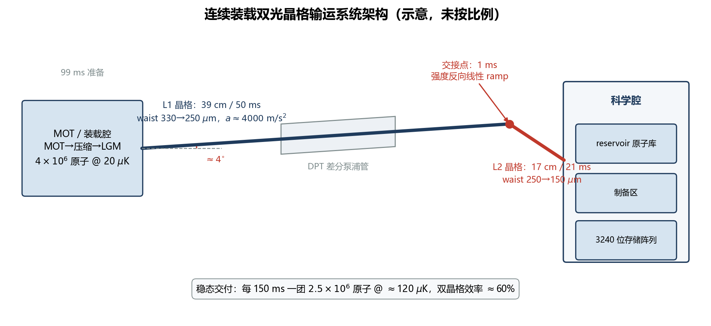

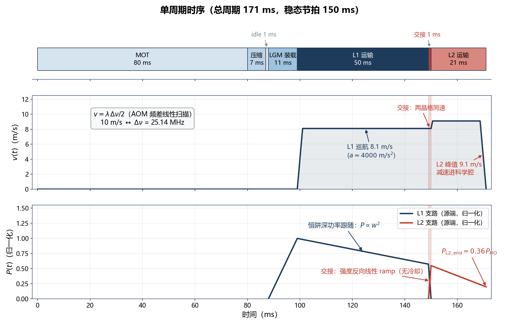

要点：

- 总周期 171 ms，稳态交付周期约 150 ms；晶格激光 $\lambda_L=795.6118$ nm（Rb D1 红失谐约 300 GHz），回程比 $R=0.88^4\simeq0.60$。
- 核心问题可归结为三个量：**原子数留存 × 温度控制 × 散射/相干性**。
- 计算方法采用双轨制：**解析宏观预算**（快，用于扫描与设计）+ **轨迹 Monte Carlo**（准，用于核验）；失谐–功率平面先用分段线性规划（LP）做可行域初筛。

# 2 物理基础

**目的：给出贯穿全程序的六组基本公式（F1–F6）与几何约束（F13）。**

## 2.1 偶极势与散射率（F1）

对碱金属基态 $S_{1/2}$，D1、D2 两条线同时贡献动态极化率。程序采用未分辨超精细结构、线偏振、标量光移近似（`continuous_loading/dipole.py`）：

**(F1a) 标量偶极势（含反旋项）**

$$U(\mathbf r)=\frac{\pi c^2 I(\mathbf r)}{2}\sum_{j=\mathrm{D1,D2}}\frac{g_j\Gamma_j}{\omega_j^3}\left[\frac{1}{\Delta_j}-\frac{1}{\omega_L+\omega_j}\right]$$

**(F1b) 总散射率（D1/D2 非相干相加）**

$$\Gamma_{\mathrm{sc}}(\mathbf r)=\frac{\pi c^2 I(\mathbf r)}{2\hbar}\sum_j\frac{g_j\Gamma_j^2}{\omega_j^3}\left[\frac{1}{\Delta_j^2}+\frac{1}{(\omega_L+\omega_j)^2}\right]$$

其中 $\Delta_j=\omega_L-\omega_j$，$g_j$ 为 D1:D2 = 1:2 权重。红失谐时 $U<0$，原子被吸引到波腹；程序对外报告正阱深 $U_0/k_B=|U|/k_B$（µK）。


要点：

- 远失谐标度：$U_0\propto P/(w^2|\Delta|)$，$\Gamma_{\mathrm{sc}}\propto P/(w^2\Delta^2)$；固定阱深下 $P_{\mathrm{req}}\propto|\Delta|$ 而 $\Gamma_{\mathrm{sc}}\propto1/|\Delta|$——这是 Cs 方案失谐选择的基本折中。
- $\Gamma_{\mathrm{sc}}$ 是总散射事件率的工程估计，用于反冲加热预算；不区分 Rayleigh/Raman，不能直接给出钟态相干时间。

## 2.2 驻波强度、阱深与阱频（F2、F3）

前向功率 $P_f$ 与回程比 $R$ 的两束相干叠加，波腹峰值强度为

**(F2) 驻波波腹强度与单晶格势**

$$I_{\mathrm{anti}}=I_f(1+\sqrt R)^2=\frac{2P_f(1+\sqrt R)^2}{\pi w^2},\qquad V(\rho,z)=-U_0\,e^{-2\rho^2/w^2}\cos^2(kz),\quad k=\frac{2\pi}{\lambda_L}$$

在固定原子、波长、束腰和回程比下，偶极势对功率严格线性，工程上记为 $U_0=A(\delta)\,P_{\mathrm{src}}$、$\Gamma_{\mathrm{sc}}=S(\delta)\,P_{\mathrm{src}}$（LP 与设计优化均基于此线性化，见 `continuous_loading/lattice.py` 的 `evaluate_lattice()`）。

**(F3) 阱底谐振展开的阱频与临界加速度**

$$\omega_z=k\sqrt{\frac{2U_0}{m}},\qquad \omega_r=\sqrt{\frac{4U_0}{mw^2}},\qquad a_c=\frac{U_0 k}{m}$$

要点：

- $a_c$ 是加速运输的硬上限（见 F5）；论文最优工作点 $a\approx4000\ \mathrm{m/s^2}$ 需相对 $a_c$ 留显著裕量。
- 回程不等强时严格轴向势垒应乘因子 $4\sqrt R/(1+\sqrt R)^2$，当前基准 $R\approx0.60$ 下约 1% 级误差。

## 2.3 传送带原理（F4）

驻波由两束逆向传播光形成；对其中一束用 AOM 线性扫频引入频差 $\Delta\nu$，驻波图样整体平移，原子被"波腹"携带运动：

**(F4) 传送带速度**

$$v=\frac{\lambda_L\,\Delta\nu}{2}$$

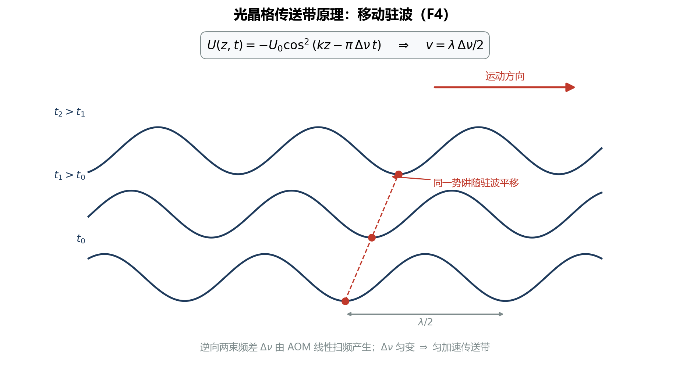

要点：$v=10\ \mathrm{m/s}\leftrightarrow\Delta\nu=25.14$ MHz；论文速度区间 8–10 m/s，L1 段采用梯形速度时序（加速–匀速–减速），加速度取 $a\approx4000\ \mathrm{m/s^2}$。

## 2.4 加速倾斜势垒与热束缚比例（F5、F6）

在晶格共动系中，轴向势多一项惯性势 $max$：$V_{\mathrm{eff}}(x)=-U_{\mathrm{ax}}\cos^2(kx)+max$。局域极小存在的条件是 $|a|<a_c$；令 $\beta=|a|/a_c$，下坡方向逃逸势垒为

**(F5) 加速倾斜势垒**

$$\frac{U_{\mathrm{eff}}}{U_0}=F(\beta)=\sqrt{1-\beta^2}-\beta\arccos\beta,\qquad 0\le\beta<1$$

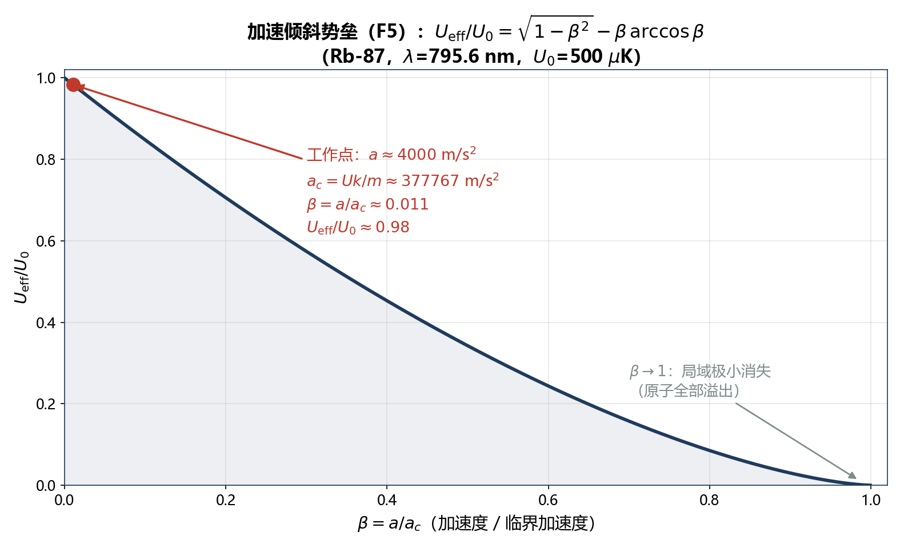

三维经典谐振热气体的总激发能服从形状参数为 3 的 Gamma 分布，能量低于势垒的比例为

**(F6) 热束缚比例**

$$F_3(\eta)=1-e^{-\eta}\left(1+\eta+\frac{\eta^2}{2}\right),\qquad \eta=\frac{U_{\mathrm{eff}}}{k_BT}$$

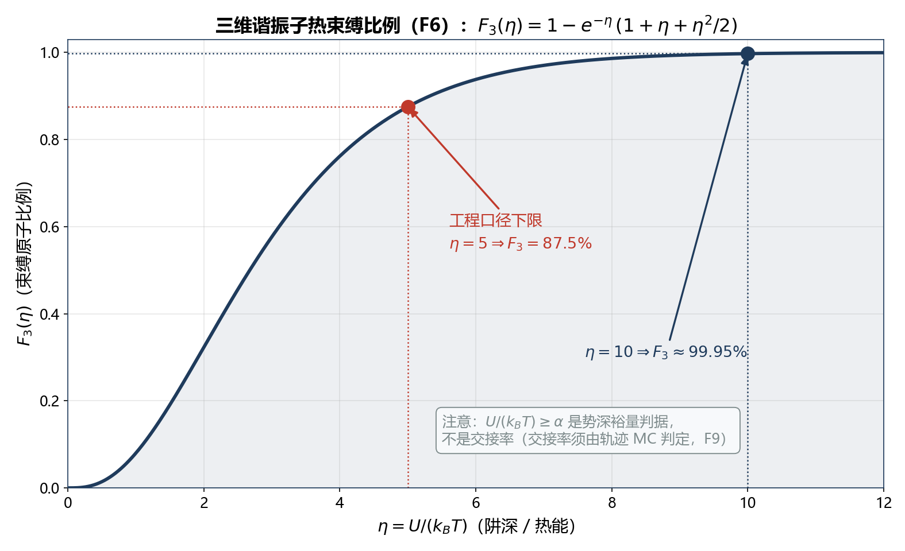

要点：

- $\eta=5\to87.5\%$，$\eta=10\to99.72\%$[^f3eta]——"$U/(k_BT)\ge5$"只是势深裕量，**不是**交接率（见 §3.3 六错误之六）。
- F5、F6 共同决定运输段的统计留存（F12），也是 LP 约束 $P_{\mathrm{bound}}$ 的物理来源（F11）。

[^f3eta]: 数字口径：$F_3(10)=99.72\%$（按 F6 公式直接计算，与 `reports/handover交接的理论修正与程序逻辑.md` §2.6 一致）；设计总纲 §4b 图注中的"99.95%"系笔误。

## 2.5 DPT 孔径与重力几何约束（F13）

高斯束经 DPT（衍射光学元件）圆孔时，孔径外功率比例由孔径平面的光斑 $w(z_{\mathrm{DPT}})$ 决定：

**(F13) DPT 截断损耗**

$$L_{\mathrm{clip}}=\exp\left[-\frac{2a^2}{w^2(z_{\mathrm{DPT}})}\right]\approx e^{-18},\qquad w(z_{\mathrm{DPT}})\le a\sqrt{\frac{2}{\ln(1/L_{\max})}}$$

其中 $a=d_{\mathrm{DPT}}/2$ 为孔半径。$w(z)=w_0\sqrt{1+((z-z_0)/z_R)^2}$，$z_R=\pi w_0^2/\lambda$。

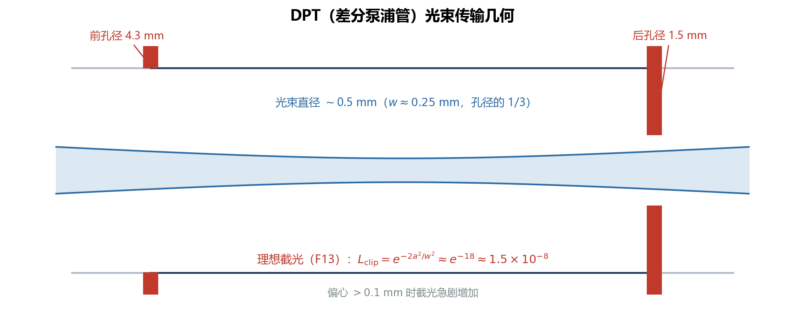

要点：

- 不能直接用束腰 $w_0$ 与 DPT 口径比较，必须检查孔径平面的光束膨胀。
- L1/L2 之间存在约 4° 夹角（避开 DPT 衍射级次几何），该夹角是交接相位失配的物理来源（§3.3）。
- 全程要求阱深 $U_{\mathrm{lat}}>500$ µK（含重力下垂与加速势垒降低后的裕量）。

# 3 分阶段物理过程与计算方法

## 3.1 装载：LGM 冷却 + 静止 L1 晶格（F8）

**目的：说明 MOT 云如何被冷却并装入静止 L1，形成 L1 运输初态。**

装载阶段 L1 保持恒定满功率高斯驻波势 $U_{\mathrm{L1}}(\mathbf r)=-U_0e^{-2(x^2+y^2)/w^2}\cos^2(kz+\phi)$，LGM 冷却用经验 Langevin 阻尼与扩散描述（`continuous_loading/loading_ramp.py` / `loading_ramp_mc.py`）：

**(F8) Langevin 装载方程与温度弛豫**

$$m\,d\mathbf v=-\nabla U_{\mathrm{L1}}\,dt-m\gamma\mathbf v\,dt+\sqrt{2m\gamma k_BT_{\mathrm{eq}}}\;d\mathbf W+d\mathbf p_{\mathrm{rec}}$$

$$T(t)=T_{\mathrm{eq}}+\left[T(0)-T_{\mathrm{eq}}\right]e^{-2\gamma t}$$

11 ms LGM 末端，对每个存活样本计算相对最近晶格阱底的总激发能，与含重力修正的局域逃逸势垒比较，束缚者构成 L1 初态：$N_{\mathrm{L1,0}}=N_{\mathrm{MOT}}\,S_{\mathrm{pre\text{-}LGM}}\,\eta_{\mathrm{capture}}$。


要点：

- 论文口径：MOT 约 $10^7$ 原子、80 ms；压缩 7 ms；idle 1 ms；LGM 11 ms 后约 $4\times10^6$ 原子 @ ~20 µK。
- 工程参数（非论文实测）：$T_{\mathrm{eq}}=20$ µK、阻尼时间 $1/\gamma=1.5$ ms、LGM 起点 100 µK、三轴云宽 0.5 mm。
- L1 入口温度取捕获样本三方向动能温度的几何平均（释放/飞行时间口径）；总激发能温度保留为非热性诊断量。

## 3.2 L1 运输：分项温升预算与双轨制（F7）

**目的：说明 39 cm / 50 ms 宏观腿的解析温升预算及其与轨迹 MC 的分工。**

解析腿（`continuous_loading/transport.py` 的 `TransportStage` 预算与 `l1_transport.py` 的时间积分器）把温升分解为可解释的独立项：

**(F7) 分项温升预算**

几何平均频率与绝热温变：

$$\bar\omega=(\omega_r^2\omega_z)^{1/3},\qquad T_{\mathrm{ad},f}=T_i\,\frac{\bar\omega_f}{\bar\omega_i}=T_i\left(\frac{w_i}{w_f}\right)^{2/3}\ (\text{恒阱深})$$

散射反冲（起终点散射率几何平均 $\bar\Gamma_{\mathrm{sc}}=\sqrt{\Gamma_i\Gamma_f}$）：

$$\bar N_{\mathrm{sc}}=\bar\Gamma_{\mathrm{sc}}\tau,\qquad \Delta T_{\mathrm{recoil}}=\bar N_{\mathrm{sc}}\,\frac{2E_r}{3k_B},\qquad E_r=\frac{\hbar^2k^2}{2m}$$

强度噪声参数加热与位置噪声加热（默认 PSD = 0，仅留接口）：

$$\Gamma_{\mathrm{para}}=\frac{\bar\omega^2}{4}S_\epsilon(2\bar\omega),\qquad \Delta T_{\mathrm{para}}=T_{\mathrm{ad}}\left[e^{\Gamma_{\mathrm{para}}\tau}-1\right],\qquad \Delta T_x=\frac{m\bar\omega^4S_x(\bar\omega)\tau}{12k_B}$$

加速度跳变（梯形速度含四个阶跃，非相干相加）：

$$\Delta T_a=\frac{1}{3k_B}\sum_i\frac{m(\Delta a_i)^2}{2\omega_z^2}$$

交接等效随机相位预算（仅解析腿上界，$f_\phi$ 为反推拟合参数，见 §3.3）：

$$\Delta T_{\mathrm{HO}}=f_\phi\,\frac{U_2/k_B}{6}$$


要点：

- 绝热项是**可逆**压缩（束腰 330→250 µm 使 20 µK → 24.07 µK），不是不可逆加热。
- 功率跟随：恒阱深约束下 $P\propto w^2$，L2 末端 $P_{\mathrm{L2,end}}=(150/250)^2P_{\mathrm{handover}}=0.36\,P_{\mathrm{handover}}$。
- 双轨分工：解析腿负责快速扫描与机制归因；轨迹 MC（`transport_mc.py`，GPU 后端为 `transport_batch.py`）用 velocity-Verlet 传播完整相空间做核验。
- 技术噪声两项默认置零——论文未公开实测 RIN/指向噪声谱，代入实测 PSD 后才参与正式预测。

## 3.3 交接 handover：双晶格时变势与轨迹 MC（F9）

**目的：说明 1 ms 交接的物理、理论修正与 Monte Carlo 判定逻辑。**

交接期间 L1 强度线性下降、L2 线性上升（无冷却），原子在完整双晶格时变势中演化。两晶格约 4° 夹角造成横向位置依赖的相位失配 $\delta\phi\simeq k\theta y$。

**(F9) 交接捕获判据（逐粒子，不接受解析替代）**

交接结束时 L1 已关闭，在 L2 共动参考系计算每条轨迹相对 L2 阱底的总激发能：

$$E_{2,i}=\frac12 m\left|\mathbf v_i-v_2\mathbf e_2\right|^2+V_2(\mathbf r_i,\tau)+U_2$$

捕获当且仅当 $E_{2,i}<U_{\mathrm{eff}}=U_2F(\beta)$（F5 的加速势垒）；交接率为 $\eta_{\mathrm{HO}}=N_c/N$，统计误差用 Jeffreys $\mathrm{Beta}(1/2,1/2)$ 后验标准差。

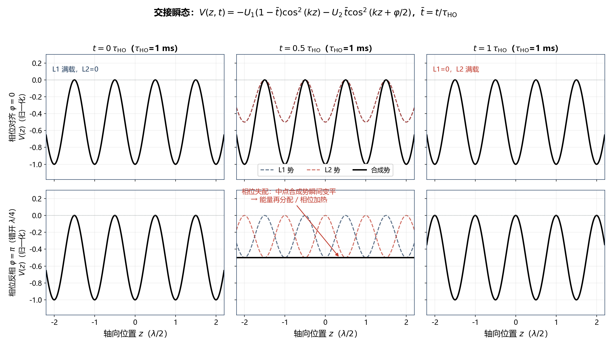

原 handover 升温推导曾把所需激光功率放大到 **3238 W**；下表六条修正把它带回瓦量级：

| # | 原错误 | 修正后口径 |
|---|---|---|
| 1 | 把条件极小值 $x_0(y,t)$ 当成移动阱中心 | 共享原点时真实平衡点恒为 $(0,0)$，夹角只改正常模方向 |
| 2 | 小角度 ⇒ 小光学相位 | 单格点展开要求 $k\theta\sigma_y\ll1$，实际 $k\theta\sigma_y=15.18$（错位约 4.83 个晶格周期） |
| 3 | 忽略周期性 → 角度能量无界 | 映射到最近格点：$\Delta E_{\mathrm{site}}=U\sin^2(k\delta q_{\mathrm{site}})\le U$；均匀相位 $\langle\Delta E\rangle=U/2$，等效温升上界 $83.3$ µK |
| 4 | 单自由度能量与三维温度混用 | $\langle E_{1D}\rangle=k_BT$ vs $\langle E_{3D}\rangle=3k_BT$，报温升前必须声明口径 |
| 5 | 1 ms 交接套用突然切换极限 | $\omega_\parallel\tau\simeq1754$（轴向远非突然）、$\omega_\perp\tau\simeq1.4$（中间区），必须数值传播轨迹 |
| 6 | 把 $U/(k_BT)\ge\alpha$ 当成交接率 | 那只是势深裕量：$F_3(5)=87.5\%$；真交接率必须逐原子统计（F9） |


要点：

- 正确工作点下 MC 结果：**交接率 ≈ 1.000，净升温 ≈ 5.8 µK**，远低于解析随机相位上界（+76.2 µK）。
- 修正后 Cs 激光选型从几千瓦回到 **3–3.5 W**（阱深 614 µK，D1 红失谐 600–700 GHz，散射率 ~500 s⁻¹）。
- 解析腿的 $f_\phi$ 是由目标终温反推的等效加热参数，不是捕获率，也可能吸收未公开的相位噪声与 AOM 瞬态。

## 3.4 L2 运输与科学区原子库（F10、F12）

**目的：说明 17 cm / 21 ms 第二段运输、科学区密度评估与全链留存。**

L2 腿复用同一积分器（`l1_transport.py` 的 `simulate_l1_transport()`，经 `dataclasses.replace()` 改写为 L2 参数：250→150 µm、21 ms、$a=4000\ \mathrm{m/s^2}$、最大速度 9.07 m/s）。科学区峰值密度与碰撞损失率：

**(F10) 科学区峰值密度与损失速率**

$$n_0=\frac{N}{N_{\mathrm{sites}}}\,\omega_r^2\omega_z\left(\frac{m}{2\pi k_BT}\right)^{3/2},\qquad \Gamma_{\mathrm{rate}}=\Gamma_{\mathrm{bg}}+b_{\mathrm{loss}}\Gamma_{\mathrm{sc}}+\frac{K_2n_0}{2^{3/2}}+\frac{K_3n_0^2}{3^{3/2}}$$

（s 波碰撞截面 $\sigma=8\pi a^2$；默认 $\Gamma_{\mathrm{bg}}=b_{\mathrm{loss}}=K_2=K_3=0$，因论文未提供可标定数据。）

**(F12) 全链留存**

$$S_{\mathrm{total}}=\eta_{\mathrm{load}}\,S_{\mathrm{L1}}\,\eta_{\mathrm{HO}}\,S_{\mathrm{L2}},\qquad S_{\mathrm{L1}}=S_{\mathrm{spill}}\cdot S_{\mathrm{rate}}$$

$$S_{\mathrm{spill}}(t)=\min_{0\le t'\le t}\left[1,\frac{F_3(t')}{F_{3,0}}\right],\qquad S_{\mathrm{rate}}(t)=\exp\left[-\int_0^t\Gamma_{\mathrm{rate}}(t')dt'\right]$$


要点：

- 累计 spilling 用 $\min$ 包络，避免重复删除同一批高能原子；这是统计截断模型，不是逐原子逃逸模拟。
- $\eta_{\mathrm{load}}=0.4$ 是 LGM 装入 L1 的输入边界（单独记录，不由未测量参数反推）。
- 论文交付口径：每 150 ms 一团 $2.5\times10^6$ 原子 @ ~120 µK，双晶格总效率约 60%（$2.5/4.0=62.5\%$ 直接原子数比）。
- 科学区后续（背景信息）：约 $3\times10^5$ 原子/s 装镊，1.5–3 万量子比特/s，3240 位存储阵列维持 >2 h。

# 4 设计优化方法：失谐–功率 LP 可行域（F11）

**目的：说明如何用分段线性规划在 $(\delta,P_{\mathrm{src}})$ 平面快速圈定可行域，再由 MC 复核。**

## 4.1 五条约束

利用线性化 $U_0=A(\delta)P_{\mathrm{src}}$、$\Gamma_{\mathrm{sc}}=S(\delta)P_{\mathrm{src}}$（F2），五个工程条件各自化为功率边界：

**(F11) LP 五约束与目标函数**

$$\begin{aligned}
&P_{\mathrm{src}}\ge P_U(\delta)=\frac{U_{\mathrm{target}}}{A(\delta)} &&\text{(最小静态阱深)}\\
&P_{\mathrm{src}}\ge P_{\mathrm{HO}}(\delta)=\frac{m}{2A(\delta)k^2}\left(\frac{2\pi N_{\min}}{\tau_{\mathrm{HO}}}\right)^2\propto\tau_{\mathrm{HO}}^{-2} &&\text{(交接最少轴向周期 }f_z\tau_{\mathrm{HO}}\ge N_{\min}\text{)}\\
&P_{\mathrm{src}}\ge P_{\mathrm{bound}}(\delta)=\frac{U_{\mathrm{bound}}(\delta)}{A(\delta)} &&\text{(加速后目标束缚比例，二分法反解)}\\
&P_{\mathrm{src}}\le P_{\mathrm{sc}}(\delta)=\frac{\Gamma_{\max}}{S(\delta)} &&\text{(最大散射率)}\\
&0\le P_{\mathrm{src}}\le P_{\max} &&\text{(硬件功率上限)}
\end{aligned}$$

其中 $U_{\mathrm{bound}}(\delta)=\min\{U_0:\ U_0\,g(m|a|/(U_0k))\ge\eta_*k_BT_{\mathrm{design}}\}$，$\eta_*=F_3^{-1}(p_{\mathrm{target}})$。可行域为

$$P_{\mathrm{lower}}(\delta)=\max(P_U,P_{\mathrm{HO}},P_{\mathrm{bound}})\ \le\ P_{\mathrm{src}}\ \le\ P_{\mathrm{upper}}(\delta)=\min(P_{\mathrm{sc}},P_{\max})$$

推荐点在分段线性化后的凸多边形顶点中最小化

$$J=\frac{P_{\mathrm{src}}}{P_{\max}}+w_\delta\,\frac{\delta-\delta_{\min}}{\delta_{\max}-\delta_{\min}},\qquad w_\delta=0.05$$

候选点回代完整非线性模型逐条复核，全部满足才标记 `exact_constraints_satisfied=true`（`continuous_loading/linear_design.py`）。

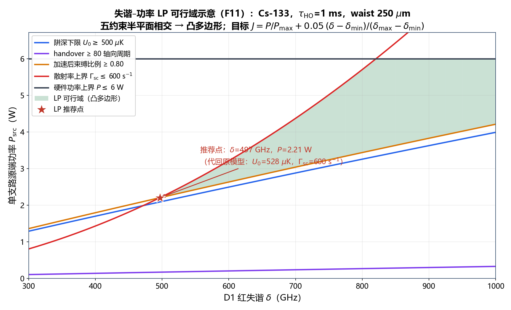


## 4.2 LP → MC 复核 → 稳健优化

要点：

- $P_{\mathrm{HO}}$、$P_{\mathrm{bound}}$ 是**工程代理条件**：前者衡量斜坡快慢的时间尺度，后者衡量加速势垒裕量；都不能替代逐轨迹交接率，故 LP 只用于初筛。
- 工作流：LP 可行域初筛（`lp-design`）→ handover map 逐点 MC 复核（`handover-map`）→ 固定时序下对失谐、功率、束腰做稳健设计优化（`optimize-design`，`continuous_loading/design_optimization.py`）。
- 分段线性化默认 28 段 × 65 检查点，下边界直线上修、上边界直线下修，保证可行域保守（宁小勿大）。

# 5 程序架构与接口

**目的：说明 `continuous_loading` 库的分层结构、数据流与两种阶段接口约定。**

## 5.1 分层架构与数据流

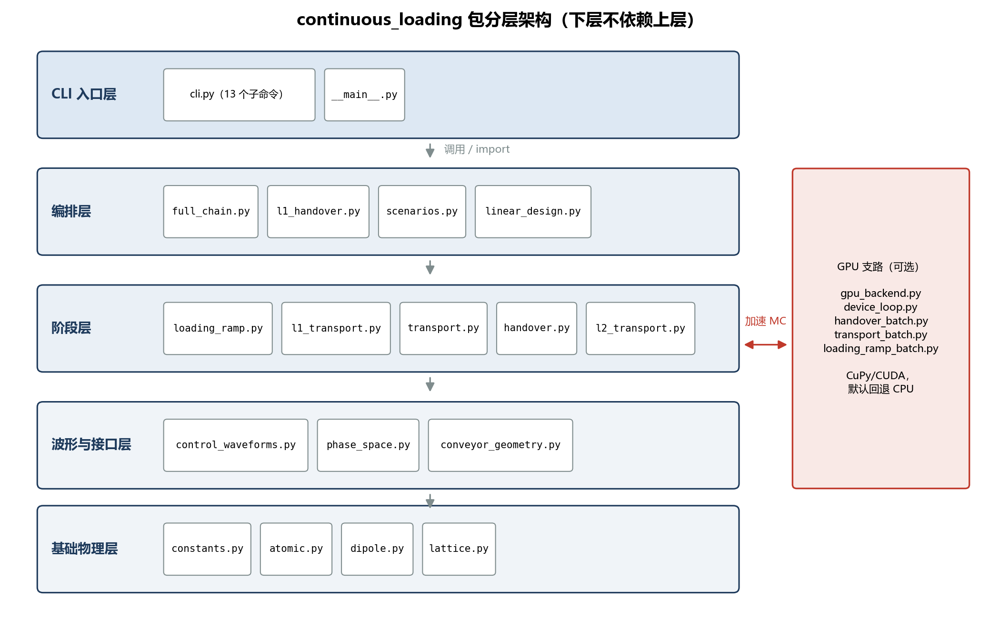

| 层 | 模块 | 职责 |
|---|---|---|
| 基础物理层 | `atomic.py`、`constants.py`、`dipole.py`、`lattice.py` | 原子数据、F1–F3 偶极势/阱频/散射 |
| 波形接口层 | `control_waveforms.py`、`conveyor_geometry.py`、`phase_space.py` | 功率/AOM 波形、传送带几何、相空间容器 `ParticleEnsemble` |
| 阶段层 | `loading_ramp*.py`、`transport.py`、`l1_transport.py`、`transport_mc.py`、`handover*.py`、`l2_transport.py` | 装载 / 解析预算 / L1 积分 / 运输 MC / 交接 MC / L2 |
| 编排层 | `scenarios.py`、`l1_handover.py`、`full_chain.py`、`linear_design.py`、`design_optimization.py` | 论文场景、扫描编排、LP、稳健优化 |
| 入口 | `cli.py`（`python -m continuous_loading`）、`ui/` | 命令行与图形界面 |
| GPU 支路 | `gpu_backend.py`、`handover_batch.py`、`transport_batch.py`、`loading_ramp_batch.py` | 批量轨迹积分加速 |

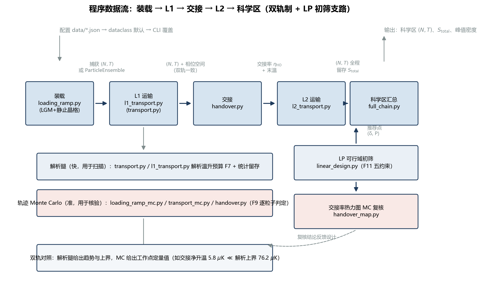

## 5.2 两种阶段接口约定

| 接口 | 传递内容 | 行为 | 适用 |
|---|---|---|---|
| 默认约化接口（标量） | 每阶段向下游传 $(N,T)$ 标量 | 下游从平衡分布重新采样；L1 入口温度取捕获样本动能温度几何平均 | 快速扫描、解析预算 |
| 连续相空间接口 | 完整 `ParticleEnsemble`（位置+速度经验分布） | handover 捕获粒子旋转到 L2 局部坐标系直接续传；粒子数调整用低方差系统重采样 | 高保真核验 |

约束：连续模式要求 loading 与运输腿均为 Monte Carlo，且禁止梯形加速度阶跃（改用 jerk 连续轨迹）；标量接口的总能量温度口径等价于附加了再热化假设，连续接口没有。

## 5.3 CLI 子命令速查

| 子命令 | 功能 |
|---|---|
| `paper` | 复现论文 Rb 双晶格参数（解析预算） |
| `cs-scan` | 扫描 Cs D1 红失谐候选（阱深/功率/散射可行性） |
| `cs-transport` | 把论文同型双晶格运输应用到 Cs |
| `loading-ramp` / `loading-ramp-scan` | LGM+静止 L1 装载单点 / LGM 时间×功率扫描（MC） |
| `handover` | 双晶格交接率与升温的单点轨迹 MC |
| `handover-map` | 失谐–功率平面交接率/升温热力图（Rb/Cs） |
| `handover-angle-scan` | L1/L2 夹角扫描 |
| `l1-transport-scan` | L1 失谐–功率升温与留存率扫描 |
| `l1-handover-scan` | L1 运输 + handover MC 同网格连接 |
| `full-chain-scan` | L1→交接→L2→科学区全链路扫描 |
| `lp-design` | 失谐–功率分段 LP 可行域与推荐点 |
| `optimize-design` | 固定时序下失谐/功率/束腰稳健优化 |
| `plots` | 生成 Rb 复现与 Cs 扫描图 |

调用形式：`python -m continuous_loading <子命令> [选项]`；配置流为 `data/*.json`（如 `paper_rb87_transport.json`、`loading_ramp_defaults.json`、`l1_transport_defaults.json`、`handover_map_defaults.json`、`design_optimization_defaults.json`）→ dataclass 默认值 → CLI 选项覆盖。

# 6 典型结果

**目的：给出 Rb 复现对照与 Cs 设计方案两组代表性输出。**

## 6.1 Rb-87 复现对照

| 量 | 论文（Nature 646, 1075） | 程序结果 | 口径 |
|---|---|---|---|
| LGM 后原子数/温度 | $4\times10^6$ @ ~20 µK | 输入边界复现 | 论文直接值 |
| L1 温升 | — | +10.8 µK（绝热+反冲） | 解析预算 |
| 交接升温 | — | 解析上界 +76.2 µK；MC 净升温 ≈5.8 µK | 解析/MC 双轨 |
| 交接率 | — | ≈1.000（正确工作点） | 轨迹 MC（F9） |
| 交付温度 | ~120 µK | 解析路径 ≈120 µK | 解析（含 $f_\phi$ 拟合） |
| 双晶格效率 | ~60% | $2.5/4.0=62.5\%$ | 直接原子数比 |
| 科学区峰值密度 | $5\times10^{11}\ \mathrm{cm^{-3}}$ | $2\times10^{12}\ \mathrm{cm^{-3}}$（同量级） | F10 |


## 6.2 Cs-133 方案设计

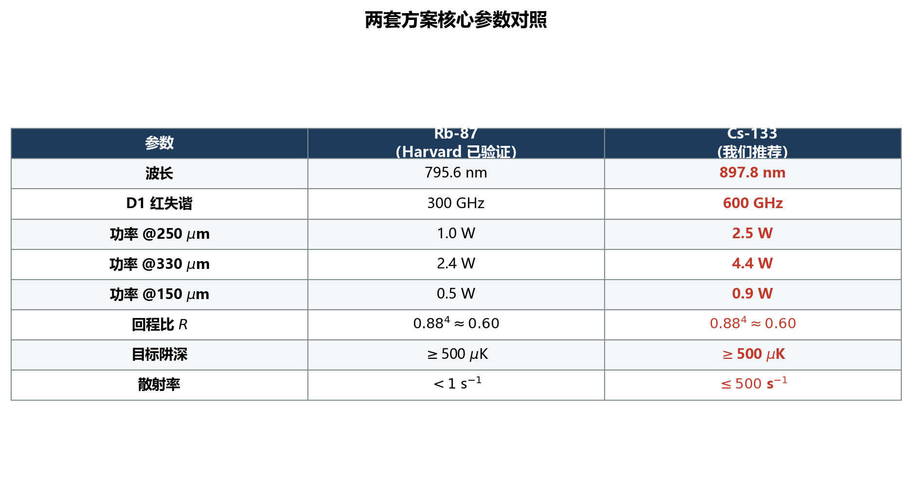


要点：

- 推荐工作点：**阱深 614 µK、D1 红失谐 600–700 GHz、源端功率 3–3.5 W/分支、散射率 ~500 s⁻¹**；对比原错误推导的 3238 W，修正后进入可工程实现区间。
- Cs 质量大、反冲小，相同阱深下反冲加热更低；主要约束来自散射率上限与硬件功率。

## 6.3 双轨结果对比的口径说明

解析温度路径（fig2/fig7 口径）与 MC 结果的差异是**口径差异而非矛盾**：解析交接项 $f_\phi U_2/6$ 是随机相位上界并为拟合参数；MC 逐粒子判定（F9）给出真实交接率与净升温。报告温度时必须注明"动能温度 / 总能量温度"口径——handover/L2 交界处的温度台阶正是两种口径之差，不是数值错误。

# 7 口径纪律与已知边界

**目的：明确本程序数字的可信边界，防止误用。**

三条口径纪律：

1. **数字一律以设计总纲 §2 为准**；发现文档间冲突时在文中加脚注说明口径来源（论文/解析/MC）。
2. **交接率只认轨迹 MC（F9）**，任何解析公式（$f_\phi$、$F_3$、$P_{\mathrm{bound}}$）都只是裕量或上界估计。
3. **工程代理条件不做物理结论**：LP 的 $P_{\mathrm{HO}}$、$P_{\mathrm{bound}}$ 用于初筛，不代表真实交接率。

已知边界（工程假设，非论文实测）：

- **再热化假设**：L2 腿把 handover MC 的总能量温度当作热平衡初温，等价于假设 21 ms 内碰撞再热化；当前密度/温度下每原子约 1 次碰撞，仅边际成立。
- **论文未公开量 = 工程假设**：LGM 起点温度/云宽、阻尼时间、$f_\phi$、噪声 PSD（默认零）。
- **损失系数默认全零**：$\Gamma_{\mathrm{bg}}=b_{\mathrm{loss}}=K_2=K_3=0$，留存率主要反映有限势垒热溢出的统计估计；配置文件留有接口，实验标定后可直接启用。
- 标量近似边界：超精细/矢量/张量光移未分辨；$\Gamma_{\mathrm{sc}}$ 不做 Rayleigh/Raman 分解；retro 不等强的轴向/径向深度未拆分（当前约 1% 级误差）。

# 8 附录

## 8.1 符号表

| 符号 | 含义 | 典型值 |
|---|---|---|
| $\lambda_L$ | 晶格激光波长 | 795.6118 nm |
| $\delta$ | D1 红失谐 | Rb 300 GHz；Cs 600–700 GHz |
| $R$ | 原子处回程/前向功率比 | $0.88^4\simeq0.60$ |
| $U_0$ | 静态阱深 | >500 µK（全程）；Cs 614 µK |
| $a,\ a_c$ | 加速度 / 临界加速度 | 4000 m/s² / $U_0k/m$ |
| $\eta$ | 势深温度比 $U_{\mathrm{eff}}/(k_BT)$ | 5 → 87.5% 束缚 |
| $f_\phi$ | 交接等效随机相位比例 | 由目标终温反推 |
| $\eta_{\mathrm{load}},\eta_{\mathrm{HO}}$ | 装载效率 / MC 交接率 | 0.4 / ≈1.000 |

## 8.2 公式索引

| 编号 | 内容 | 手册章节 |
|---|---|---|
| F1 | 标量偶极势与总散射率 | §2.1 |
| F2 | 驻波波腹强度与单晶格势 | §2.2 |
| F3 | 阱频与临界加速度 | §2.2 |
| F4 | 传送带速度 $v=\lambda\Delta\nu/2$ | §2.3 |
| F5 | 加速倾斜势垒 $F(\beta)$ | §2.4 |
| F6 | 热束缚比例 $F_3(\eta)$ | §2.4 |
| F7 | 分项温升预算（绝热/反冲/噪声/跳变/交接相位） | §3.2 |
| F8 | Langevin 装载方程 | §3.1 |
| F9 | 交接捕获判据 $E'_2<U_{2,\mathrm{eff}}$ | §3.3 |
| F10 | 科学区峰值密度与损失速率 | §3.4 |
| F11 | LP 五约束与目标函数 | §4.1 |
| F12 | 全链留存 $S_{\mathrm{total}}$ | §3.4 |
| F13 | DPT 截断 $L_{\mathrm{clip}}\approx e^{-18}$ | §2.5 |

## 8.3 CLI 命令速查

见 §5.3 表；常用序列示例：

```
python -m continuous_loading paper --json output/paper_rb87.json
python -m continuous_loading lp-design --species cs133
python -m continuous_loading handover-map --species rb87
python -m continuous_loading full-chain-scan --species rb87
```

## 8.4 reports/ 理论文档索引

| 文档 | 内容 |
|---|---|
| `reports/连续装载双光晶格计算理论框架.md` | 总框架：F1–F3、F7、模块与输出字段 |
| `reports/光晶格输运过程分析_修正版.md` | 输运物理修正：F5、F6、F13、反冲预算 |
| `reports/LGM静止L1装载模型实现说明.md` | F8 装载模型与温度口径 |
| `reports/handover交接的理论修正与程序逻辑.md` | 六错误修正、F9 捕获判据、MC 逻辑 |
| `reports/失谐量-功率分段线性规划理论框架.md` | F11 LP 推导与读图方法 |
| `reports/L1-L2运输与全链路计算框架.md` | F10、F12、L2 与全链扫描 |
| `reports/程序计算流程与物理过程时序.md` | 阶段接口约定（标量 vs 相空间连续） |
| `reports/MOT到科学区参数提取.md` | 论文参数提取与来源标注 |
