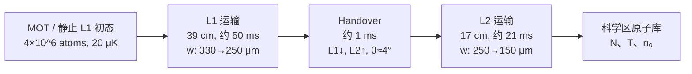
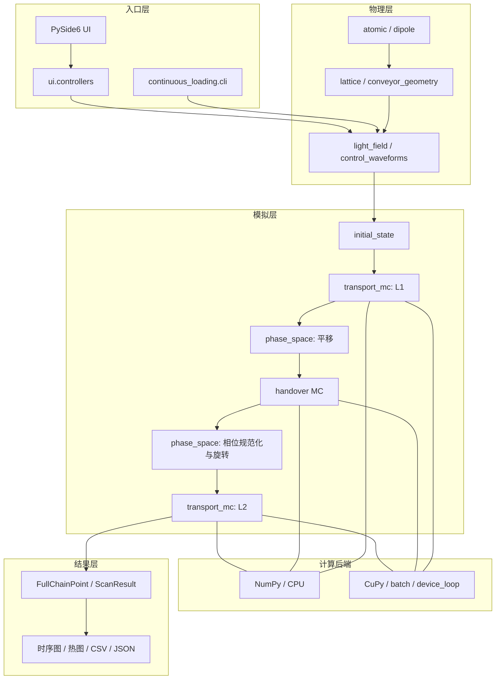

# 双光晶格连续装载全链路物理与数值研究报告

> **模型口径更新（2026-08-21）**：当前源码的 L1/L2 运输腿已改为固定源端功率，局部光强和阱深随束腰变化。本文第 4 节及 `output/` 现有 CSV/图片生成于修改前的恒阱深功率跟随模型，保留作历史结果，不能视为固定功率模型的新数值结论。

## 摘要

本工作围绕冷原子从 MOT 区经 Lattice-1（L1）、双晶格 handover 和 Lattice-2（L2）连续输运至科学区的问题，建立了从光场、单原子动力学到全链路统计量的计算框架。程序同时提供快速解析预算和连续相空间 Monte Carlo（MC）两种口径；后者以同一批粒子的六维相空间贯穿 L1、handover 和 L2，显式计算时变偶极力、重力、散射反冲与逃逸选择。

本文只使用仓库中已有程序、报告、`output/` 图片及两份 CSV，不重新运行仿真。现有结果表明：失谐—功率可行边界近似线性；云宽通过无量纲参数

$$
\chi=\frac{\sigma_c\sin\theta}{w}
$$

控制 handover 重合质量；当云宽由 $0.5\,\mathrm{mm}$ 增至 $1.5\,\mathrm{mm}$ 时，在 Cs-133、$\delta_{D1}=200\,\mathrm{GHz}$、$P=1.1\,\mathrm W$ 的既有扫描点上，handover 交接率由 $1.000$ 降至 $0.956$，全链路温升增加 $20.41\,\mu\mathrm K$，科学区峰值密度下降约 $48.5\%$。几何重合尺度因而是当前模型中最关键的实验参数之一。

注：源码及相关文件快照已上传至https://github.com/Left-Zeap/lattice-handover-mc/
如有需要可以尝试下载源码及相关文档和数据图表

---

# 一、导言

## 1.1 程序库的作用

该程序库面向双光晶格连续装载实验，目标不是求解完整量子处理器，而是回答原子供应链中的定量问题：

1. 给定原子种类、失谐、功率、束腰和回程比，晶格阱深、散射率和阱频是多少；
2. 原子能否在 L1 和 L2 的高速加速运输中保持束缚；
3. 两套成角度晶格在 handover 时会产生多少升温和损失；
4. 原子云宽、晶格夹角、相对相位和横向偏移如何限制交接率；
5. 哪些失谐—功率组合能够兼顾束缚、低散射和高留存；
6. 原子到达科学区后的温度、原子数和峰值密度是多少。

全链路可写为

$$
\mathrm{MOT}\rightarrow \mathrm{L1}\rightarrow
\mathrm{handover}\rightarrow \mathrm{L2}\rightarrow
\mathrm{science\ region}.
$$

它对应 3000-qubit 连续运行论文中的冷原子输运部分：约 $4\times10^6$ 个、$20\,\mu\mathrm K$ 的 Rb-87 原子被送入 L1，经过 $39\,\mathrm{cm}$ 的 L1 运输、$1\,\mathrm{ms}$ handover 和 $17\,\mathrm{cm}$ 的 L2 运输后，在科学区形成可被光镊反复提取的原子库。

## 1.2 本文研究链条

本文采用以下逻辑：

$$
\boxed{\text{光场}}\rightarrow
\boxed{\text{力与随机反冲}}\rightarrow
\boxed{\text{单原子轨迹}}\rightarrow
\boxed{\text{系综温度与留存}}\rightarrow
\boxed{\text{实验参数窗口}}.
$$

---

# 二、物理理论

## 2.1 光场的时空分布

### 2.1.1 移动光晶格的来源

每套晶格由一束前向高斯光和逆向回程光相干叠加形成。对束轴坐标 $z$、横向距离 $\rho$，双束势可写为

$$
\begin{aligned}
V(\rho,z,t)=-|C_U|\Big[&I_1e^{-2\rho^2/w_1^2}
+I_2e^{-2\rho^2/w_2^2}\\
&+2\sqrt{I_1I_2}
e^{-\rho^2(w_1^{-2}+w_2^{-2})}
\cos\big(2k[z-z_L(t)]-\phi\big)\Big],
\end{aligned}
$$

其中 $k=2\pi/\lambda$，$z_L(t)$ 是晶格位置，$C_U$ 是单位光强的偶极势系数。若两束共腰且回程功率比为 $R=P_r/P_f$，波腹强度为

$$
I_{\rm anti}=\frac{2P_f}{\pi w^2}(1+\sqrt R)^2,
$$

轴向调制深度为

$$
U_{\rm ax}=4|C_U|\sqrt{I_1I_2}.
$$

两束光的频差使驻波移动：

$$
v_L(t)=\frac{\lambda\Delta\nu(t)}{2}.
$$

程序默认 $R=0.88^4\simeq0.5997$，因此节点处仍有残余行波光强，轴向调制深度与波腹总深度并不完全相同。

### 2.1.2 L1、handover 与 L2 的空间排布

默认模型采用恒阱深功率跟随。若束腰沿程变化为 $w(z)$，则源端功率近似满足

$$
P_{\rm src}(z)=P_{\rm HO}
\left(\frac{w(z)}{w_{\rm HO}}\right)^2.
$$

因此

$$
P_{L1}(0)=P_{\rm HO}\left(\frac{330}{250}\right)^2
\simeq1.742P_{\rm HO},
$$

$$
P_{L2}(L_2)=P_{\rm HO}\left(\frac{150}{250}\right)^2
=0.36P_{\rm HO}.
$$

无实测波形时，handover 使用反向线性 ramp：

$$
f_1(t)=1-\frac{t}{\tau_{\rm HO}},\qquad
f_2(t)=\frac{t}{\tau_{\rm HO}},
$$

$$
V_{\rm HO}(\mathbf r,t)=f_1(t)V_1(\mathbf r)+f_2(t)V_2(\mathbf r).
$$

L1 与 L2 的光轴相交但不重合。取

$$
\hat{\mathbf e}_1=(0,0,1),\qquad
\hat{\mathbf e}_2=(\sin\theta,0,\cos\theta),
$$

则原子沿 L1 轴偏离交点 $z$ 时，到 L2 轴的横向距离近似为

$$
\rho_2(z)\simeq |z|\sin\theta.
$$

### 2.1.3 Handover 重合区域

L2 在 L1 轴上的有效深度为

$$
U_2(z)=U_{2,0}
\exp\left(-\frac{2z^2}{z_{\rm ov}^2}\right),
\qquad
z_{\rm ov}=\frac{w}{\sin\theta}.
$$

在 $w=250\,\mu\mathrm m$、$\theta=4^\circ$ 时

$$
z_{\rm ov}=3.58\,\mathrm{mm}.
$$

因此云宽控制参数不是单独的 $\sigma_c/w$，而是

$$
\boxed{\chi=\frac{\sigma_c}{z_{\rm ov}}
=\frac{\sigma_c\sin\theta}{w}}.
$$

这一关系同时给出三种工程方向：减小云宽 $\sigma_c$、减小夹角 $\theta$ 或增大交接束腰 $w$，都可以扩大有效重合比例。

## 2.2 原子—光作用与单原子受力

### 2.2.1 AC Stark 偶极势

程序对碱金属 D1、D2 线采用标量远失谐近似：

$$
U(\mathbf r)=\frac{\pi c^2}{2}I(\mathbf r)
\sum_{j\in\{D1,D2\}}
\frac{g_j\Gamma_j}{\omega_j^3}
\left(\frac{1}{\Delta_j}
-\frac{1}{\omega_L+\omega_j}\right),
$$

其中 $g_{D1}:g_{D2}=1:2$，$\Delta_j=\omega_L-\omega_j$。红失谐时 $U<0$，原子被吸引到波腹。

保守偶极力为

$$
\mathbf F_{\rm dip}=-\nabla U(\mathbf r,t).
$$

### 2.2.2 非相干散射与反冲

散射率近似为

$$
\Gamma_{\rm sc}(\mathbf r)=
\frac{\pi c^2}{2\hbar}I(\mathbf r)
\sum_j\frac{g_j\Gamma_j^2}{\omega_j^3}
\left[\frac{1}{\Delta_j^2}
+\frac{1}{(\omega_L+\omega_j)^2}\right].
$$

在一步 $\Delta t$ 内，散射事件数满足

$$
N_{\rm sc}\sim\operatorname{Poisson}
(\Gamma_{\rm sc}\Delta t).
$$

每次事件给出速度跃迁

$$
\Delta\mathbf v=\frac{\hbar k}{m}
\left(s\hat{\mathbf e}_{\rm abs}
-\hat{\mathbf n}_{\rm em}
\right),
$$

其中 $s=\pm1$ 表示从前向或回程光吸收，$\hat{\mathbf n}_{\rm em}$ 为各向同性自发辐射方向。

### 2.2.3 完整运动方程

全链路单原子满足

$$
m\ddot{\mathbf r}=
-\nabla\big(V_{L1}+V_{L2}\big)
+m\mathbf g
+\mathbf F_{\rm recoil}.
$$

移动晶格的共动系中还出现惯性倾斜 $ma q$。定义

$$
a_c=\frac{U_{\rm ax}k}{m},\qquad
\beta=\frac{|a|}{a_c},
$$

轴向下坡势垒为

$$
U_{\rm eff}=U_{\rm ax}
\left[\sqrt{1-\beta^2}-\beta\arccos\beta\right],
\qquad \beta<1.
$$

当 $\beta\ge1$ 时局域极小值消失。Handover 结束后，程序在 L2 共动系中计算

$$
E_{2,f}=\frac12m|\mathbf v-v_2\hat{\mathbf e}_2|^2
+V_2(\mathbf r,t_f)-V_{2,\min},
$$

并以

$$
E_{2,f}<\min(U_{\rm axial,eff},U_{\rm gravity})
$$

作为捕获判据。

## 2.3 多体、重力与技术噪声

### 2.3.1 多体作用

单格点谐振近似下，峰值密度为

$$
n_0=\frac{N}{N_{\rm site}}\omega_r^2\omega_z
\left(\frac{m}{2\pi k_BT}\right)^{3/2}.
$$

相同玻色子的低温弹性碰撞截面和平均相对速度为

$$
\sigma_s=8\pi a_s^2,
\qquad
\bar v_{\rm rel}=\sqrt{\frac{16k_BT}{\pi m}},
$$

$$
\Gamma_{\rm coll}=n_0\sigma_s\bar v_{\rm rel}.
$$

仓库已有估算给出 $\Gamma_{\rm coll}\approx80$--$300\,\mathrm{s^{-1}}$：

| 阶段 | 每原子碰撞次数 | 判断 |
|---|---:|---|
| L1，约 50 ms | 约 8 | 足以维持近热平衡 |
| handover，1 ms | 约 0.2 | 可近似为单粒子过程 |
| L2，约 21 ms | 约 2--6 | 只能部分再热化 |

再热化时间

$$
\tau_{\rm reth}\simeq\frac{2.7}{\Gamma_{\rm coll}}
\approx9\text{--}17\,\mathrm{ms}
$$

与 L2 时长同量级。因此“handover 末态立即成为 L2 热平衡初态”只是边际近似；连续相空间 MC 不需要这一假设。

平均场能 $gn_0/k_B$ 仅为 nK 量级，相空间密度约 $10^{-4}$，量子简并和流体动力学均可忽略。值得后续加入的是碰撞再热化、蒸发和需实验标定的两体光辅助损失。

### 2.3.2 重力

程序统一取

$$
\mathbf F_g=(0,-mg,0).
$$

径向势

$$
V(y)=-Ue^{-2y^2/w^2}+mgy
$$

同时产生平衡下垂和下坡鞍点。只有当最大高斯恢复力满足

$$
\frac{2U}{w}e^{-1/2}>mg
$$

时径向束缚存在。实际逃逸势垒取轴向加速势垒和径向重力势垒的较小值。

### 2.3.3 技术噪声

解析接口为强度噪声和位置噪声预留了加热项：

$$
\frac{1}{T}\frac{dT}{dt}
=\frac{\bar\omega^2}{4}S_I,
$$

$$
\frac{dT}{dt}\bigg|_{x}
=\frac{m\bar\omega^4}{12k_B}S_x.
$$

当前默认 $S_I=S_x=0$，所以输出不能被解释为包含真实 RIN、相位噪声和指向噪声的实验寿命预测。

---

# 三、程序库与连续相空间 Monte Carlo

## 3.1 程序架构

核心模块职责如下：

| 模块 | 作用 |
|---|---|
| `atomic.py`, `dipole.py` | 原子常数、D1/D2 偶极势和散射 |
| `lattice.py` | 阱深、阱频、临界加速度、重力势垒 |
| `initial_state.py` | 静止 L1 中的束缚热平衡初态 |
| `transport_mc.py` | L1/L2 六维轨迹传播 |
| `handover.py` | 双晶格交接、散射和 L2 捕获 |
| `phase_space.py` | 阶段平移、旋转、相位规范化、低方差重采样 |
| `chain_mc.py`, `full_chain.py` | 全链路编排与统计汇总 |
| `gpu_backend.py`, `*_batch.py`, `device_loop.py` | GPU 批量积分 |
| `ui/` | 参数输入、后台计算、图表和导出 |

## 3.2 连续相空间 MC 的计算流程

每个样本是一条经典轨迹

$$
X_i=(\mathbf r_i,\mathbf v_i),\qquad i=1,\ldots,N_{\rm MC}.
$$

计算分为八步。

### 步骤 1：预计算光场时序

在传播前生成

$$
\{t,z_L,v_L,a,I_1,I_2,w_1,w_2\}_{L1,L2}
$$

及

$$
\{t,f_1,f_2,\phi_{\rm ctrl}\}_{\rm HO}.
$$

若提供实测 CSV，则位置、速度、加速度、AOM 频差、束腰和功率比例由实测波形覆盖。

### 步骤 2：采样静止 L1 初态

谐振近似给出提议宽度

$$
\sigma_r=\frac{1}{\omega_r}
\sqrt{\frac{k_BT}{m}},\qquad
\sigma_z=\frac{1}{\omega_z}
\sqrt{\frac{k_BT}{m}},
$$

速度服从 Maxwell 分布

$$
\sigma_v=\sqrt{\frac{k_BT}{m}}.
$$

随后用完整周期势拒绝不满足束缚条件的样本，并按 $\sigma_c$ 将原子吸附到最近的 $\lambda/2$ 晶格点。

### 步骤 3：L1 传播

采用 velocity-Verlet：

$$
\mathbf v_{n+1/2}=\mathbf v_n+
\frac{\Delta t}{2m}\mathbf F_n,
$$

$$
\mathbf r_{n+1}=\mathbf r_n+
\Delta t\,\mathbf v_{n+1/2},
$$

$$
\mathbf v_{n+1}=\mathbf v_{n+1/2}+
\frac{\Delta t}{2m}\mathbf F_{n+1}.
$$

步长自动满足

$$
\omega_{z,\max}\Delta t\le1,
$$

以避免辛积分器在深晶格中的数值能量漂移。

### 步骤 4：L1 末态坐标转换

原子位置平移至 handover 局部原点，速度和相空间关联保持不变。

### 步骤 5：Handover 传播与捕获

粒子在 $V_1+V_2$ 中完成整段传播，段内不做解析捕获删除；终点再按 L2 共动系能量统一判断。交接率和 Jeffreys 标准误为

$$
\eta_{\rm HO}=\frac{N_{\rm cap}}{N_{\rm in}},
$$

$$
\sigma_\eta=
\sqrt{\frac{(N_{\rm cap}+1/2)(N-N_{\rm cap}+1/2)}
{(N+1)^2(N+2)}}.
$$

### 步骤 6：相位规范化与 L2 旋转

对每条轨迹执行

$$
q'=q-z_L+\frac{\phi}{k},qquad
\mathbf v'=\mathbf v-v_L\hat{\mathbf e}_2,
$$

再将坐标正交旋转到 L2 局部系。该操作保持动能温度，不人为重新热化。

### 步骤 7：L2 传播

沿用 L1 的双束力、散射和逃逸判据。L2 末态保留完整幸存粒子集合。

### 步骤 8：系综统计

去除质心速度后定义动能温度

$$
T_{\rm kin}=\frac{m}{3k_B}
\left\langle|\mathbf v-\langle\mathbf v\rangle|^2\right\rangle.
$$

总留存写为

$$
S_{\rm total}=S_{\rm boundary}S_{L1}
\eta_{\rm HO}S_{L2}.
$$

其中 $S_{\rm boundary}=N_{L1,0}/N_{\rm MOT}$ 取决于一次计算采用的计数边界。

## 3.3 图形化计算与可视化入口

界面将参数、单点、时序、二维扫描、云宽扫描和结果导出集成在同一窗口。耗时任务运行在后台线程，参数经过 `ui.controllers` 转换为 `FullChainInputs`，计算核心不依赖界面。

图中既有 Cs-133 单点给出：L1 末温 $32.11\,\mu\mathrm K$，handover 末温 $41.37\,\mu\mathrm K$，科学区末温 $56.73\,\mu\mathrm K$，handover 交接率 $1.000\pm0.001$。该截图对应一次具体界面配置，用于展示计算入口和输出组织，不代表论文 Rb-87 基准。

---

# 四、已有结果与定量分析

## 4.1 数据口径

本节使用以下已有文件：

| 图或数据 | 含义 |
|---|---|
| `fig1（0.5mm）.png`、`fig1_export_*.csv` | $\sigma_c=0.5\,\mathrm{mm}$ 二维扫描 |
| `fig3（1.5mm）.png`、`fig3_export_*.csv` | $\sigma_c=1.5\,\mathrm{mm}$ 二维扫描 |
| `fig2（200ghz，1.1w）.png` | 固定工作点的温度—云宽曲线 |
| `fig4（200ghz，1.1w）.png` | 固定工作点的效率—云宽曲线 |

结合输出文件与同次界面截图，该组结果采用 Cs-133、$w=250\,\mu\mathrm m$、$\theta=4^\circ$、源端到原子效率 $0.70$、回程比 $0.5997$、目标阱深 $500\,\mu\mathrm K$。二维网格为

$$
\delta_{D1}=100\text{--}800\,\mathrm{GHz},\qquad
P=0\text{--}2.5\,\mathrm W,
$$

共 $29\times26=754$ 点，其中 687 点有有效 handover 结果。

CSV 导出时设置了 $N_{L1,0}=N_{\rm MOT}=10^7$，所以图中的“相对 MOT 留存”实际上等于该次计算边界后的链路留存；它没有再乘论文中 $4\times10^6/10^7=0.4$ 的前级装载因子。

## 4.2 云宽为 0.5 mm 的二维扫描

主要趋势为：

$$
P\uparrow\Rightarrow U\uparrow\Rightarrow
\eta_{\rm HO}\uparrow,\quad S_{\rm total}\uparrow,
$$

但同时

$$
P\uparrow\Rightarrow\Gamma_{\rm sc}\uparrow
\Rightarrow\Delta T\uparrow.
$$

增大红失谐会降低单位功率势深，因此保持相同束缚条件需要更高功率；与此同时，固定势深下的散射近似按 $1/|\Delta|$ 下降。

在 $\delta_{D1}=200\,\mathrm{GHz}$、$P=1.1\,\mathrm W$ 处，CSV 给出

$$
\eta_{\rm HO}=1.000,
$$

$$
\Delta T_{\rm chain}=34.54\,\mu\mathrm K,
$$

$$
S_{\rm total}=0.998,
\qquad
n_{0,f}=8.23\times10^{18}\,\mathrm{m^{-3}}.
$$

## 4.3 云宽增至 1.5 mm

同一工作点变为

$$
\eta_{\rm HO}=0.956,
$$

$$
\Delta T_{\rm chain}=54.95\,\mu\mathrm K,
$$

$$
S_{\rm total}=0.8279,
\qquad
n_{0,f}=4.24\times10^{18}\,\mathrm{m^{-3}}.
$$

两种云宽的直接比较为

| 指标 | 0.5 mm | 1.5 mm | 变化 |
|---|---:|---:|---:|
| handover 交接率 | 1.000 | 0.956 | $-4.4$ 个百分点 |
| 全链路温升 | 34.54 μK | 54.95 μK | $+20.41$ μK，$+59.1\%$ |
| 链路留存 | 0.998 | 0.8279 | $-17.0$ 个百分点 |
| 科学区峰值密度 | $8.23\times10^{18}$ | $4.24\times10^{18}$ | $-48.5\%$ |

密度下降不仅来自原子数减少，还来自温度升高：

$$
n_0\propto N\,T^{-3/2}.
$$

因此云宽通过“交接损失”和“升温膨胀”两个通道共同压低科学区密度。

对所有 687 个匹配有效点统计，$1.5\,\mathrm{mm}$ 相对 $0.5\,\mathrm{mm}$ 的 handover 交接率平均下降 0.129，中位下降 0.094；链路留存中位下降 0.203。这表明云宽影响不是单一工作点偶然现象。

## 4.4 失谐—功率等高线的近线性关系

远失谐极限下

$$
U\propto\frac{P}{w^2|\Delta|},
$$

所以固定阱深首先给出

$$
P\propto |\Delta|.
$$

对已有 CSV 在相邻功率点之间线性插值，再对等高线做最小二乘拟合，得到下列经验式。$\delta$ 的单位为 GHz，$P$ 的单位为 W。

| 云宽 | 等高线 | 经验式 | $R^2$ | 拟合范围 |
|---|---|---|---:|---|
| 0.5 mm | $S_{\rm total}=0.50$ | $P=0.0661+4.690\times10^{-4}\delta$ | 0.990 | 200--800 GHz |
| 1.5 mm | $S_{\rm total}=0.50$ | $P=0.0543+1.351\times10^{-3}\delta$ | 0.992 | 100--800 GHz |
| 1.5 mm | $\eta_{\rm HO}=0.95$ | $P=0.192+3.718\times10^{-3}\delta$ | 0.988 | 100--625 GHz |
| 1.5 mm | $\eta_{\rm HO}=0.98$ | $P=0.334+5.914\times10^{-3}\delta$ | 0.978 | 100--325 GHz |

结论有两点：

1. 等高线近似线性与远失谐偶极势的 $P/|\Delta|$ 标度一致；
2. 云更宽、目标交接率更高时，斜率显著增大，即提高失谐所需的功率补偿更强。

这些公式是当前网格内的经验回归，不应外推到 D1/D2 结构变化明显、功率超过扫描范围或技术噪声主导的区域。

## 4.5 云宽临界变化

温度曲线显示，$\chi$ 从约 0.1 增至 0.5 时，handover 末温近似持续上升；链末温在较大 $\chi$ 时趋于平台并出现波动。这是因为 L2 会优先移除高能、远离重合区的原子，幸存样本出现选择性降温。

重合窗口模型给出

$$
\eta_{\rm HO}(\sigma_c)\simeq
\operatorname{erf}\left(
\frac{z_c}{\sqrt2\sigma_c}
\right),
$$

已有报告和曲线对应的有效窗口为

$$
z_c\simeq3.4\,\mathrm{mm}
\simeq0.95z_{\rm ov}.
$$

因此可写成无量纲形式

$$
\boxed{
\eta_{\rm HO}(\chi)\simeq
\operatorname{erf}\left(
\frac{0.95}{\sqrt2\chi}
\right)}.
$$

由此得到几何临界值：

| 目标交接率 | $\chi_{\max}$ | $\sigma_{c,\max}$，$w=250\,\mu$m、$\theta=4^\circ$ |
|---:|---:|---:|
| 0.98 | 0.408 | 1.46 mm |
| 0.95 | 0.485 | 1.74 mm |
| 0.90 | 0.577 | 2.07 mm |
| 0.75 | 0.826 | 2.96 mm |

该公式与图中 $\chi\simeq0.84$ 时 $\eta_{\rm HO}\simeq0.74$ 相符。全链路留存下降更快，因为

$$
S_{\rm total}=S_{L1}\eta_{\rm HO}S_{L2},
$$

而重合区边缘原子即使通过 handover，也更容易在 L2 段逃逸。

## 4.6 结果归纳

1. **功率—失谐存在近线性工作边界。** 物理来源是远失谐势深 $U\propto P/|\Delta|$；现有等高线拟合的 $R^2$ 可达 0.98--0.99。
2. **云宽是 handover 的关键几何控制量。** 应使用 $\chi=\sigma_c\sin\theta/w$，而不是只比较 $\sigma_c/w$。
3. **升温比交接率更早响应云宽。** 在交接率仍接近平台时，重合区边缘原子已经产生明显非绝热激发。
4. **科学区密度对云宽尤为敏感。** 因为 $n_0\propto NT^{-3/2}$，原子损失和升温会相乘放大密度下降。
5. **负温升点不是主动冷却。** CSV 在极低留存区出现最低约 $-18\,\mu\mathrm K$ 的“总温升”，其来源是高能原子被优先删除后的幸存选择，不能解释为新的冷却机制。
6. **高功率不能无限改善结果。** 它提高束缚裕量，但也增加散射反冲；最佳区域应位于高留存、低温升和硬件功率限制共同形成的平台，而不是简单取最大功率。

---

# 五、总结与展望

## 5.1 已完成的工作

本工作完成了以下内容：

1. 建立 Rb-87/Cs-133 的 D1/D2 标量偶极势、散射率、阱深和阱频模型；
2. 建立 L1、双晶格 handover、L2 的时空光场与运动学模型；
3. 建立静止 L1 束缚热平衡初态和连续六维相空间 MC；
4. 实现重力、倾斜势垒、随机散射反冲、逃逸选择和统计误差；
5. 实现 CPU/GPU、单点、二维扫描、云宽扫描和实测控制波形接口；
6. 集成 PySide6 图形界面，实现参数设置、后台计算、时序可视化和结果导出；
7. 从已有结果中提取失谐—功率近线性等高线，并建立云宽—重合尺度临界公式。

## 5.2 当前结论

最重要的实验设计关系为

$$
P\sim |\Delta|w^2,
$$

$$
U_{\rm eff}=U_{\rm ax}
\left[\sqrt{1-\beta^2}-\beta\arccos\beta\right],
$$

$$
\chi=\frac{\sigma_c\sin\theta}{w},
$$

$$
\eta_{\rm HO}(\chi)\simeq
\operatorname{erf}\left(\frac{0.95}{\sqrt2\chi}\right),
$$

$$
n_0\propto N T^{-3/2}.
$$

这些公式构成了从激光器功率、晶格几何到最终原子库密度的主要逻辑链。

## 5.3 后续完善方向

1. **输入实测波形。** 用 AOM 相位、频差、功率和束腰实测数据替代理想 minimum-jerk 与线性 handover ramp。
2. **加入碰撞再热化。** 在 L2 段引入基于 $\Gamma_{\rm coll}$ 的碰撞事件或 Boltzmann 碰撞算子，检验各向异性温度的弛豫。
3. **标定真实损失。** 测量背景寿命、光辅助二体损失、内态改变概率和技术噪声谱，替换当前默认零值。
4. **升级多能级原子模型。** 区分 Rayleigh/Raman 散射及 $F,m_F$ 依赖的标量、矢量和张量光移。
5. **加入量子输运修正。** 在浅晶格或高速扫频区评估 Bloch 能带、Landau--Zener 隧穿和带间激发。
6. **开展不确定度传播。** 对束腰、夹角、云宽、传输效率和相对相位做联合抽样，给出实验容差而非单一理想曲线。
7. **统一结果元数据。** 后续 CSV/图片应同时保存原子种类、初始原子数、云宽、MC 粒子数、随机种子和模型版本，避免脱离计算口径解释图表。

---

## 数据与理论来源

- `Continuous operation of 3000qbit.pdf`
- `continuous_loading/` 当前计算代码
- `reports/handover交接的理论修正与程序逻辑.md`
- `reports/激光空间分布与束腰功率表征.md`
- `reports/多体效应定量评估报告.md`
- `reports/handover云宽尺度猜想与验证.md`
- `output/figures/` 现有图片
- `output/fig1_export_20260820_175215.csv`
- `output/fig3_export_20260820_183249.csv`

